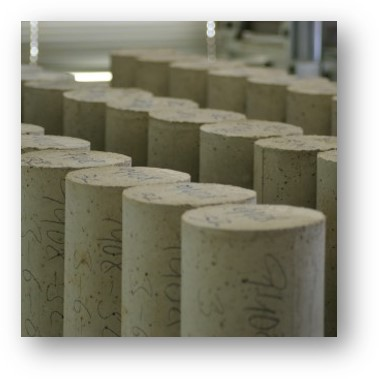
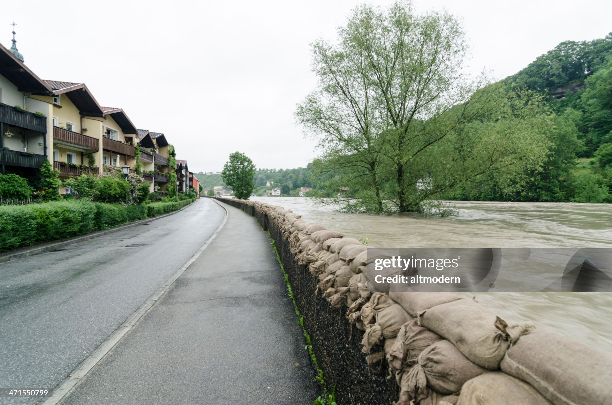
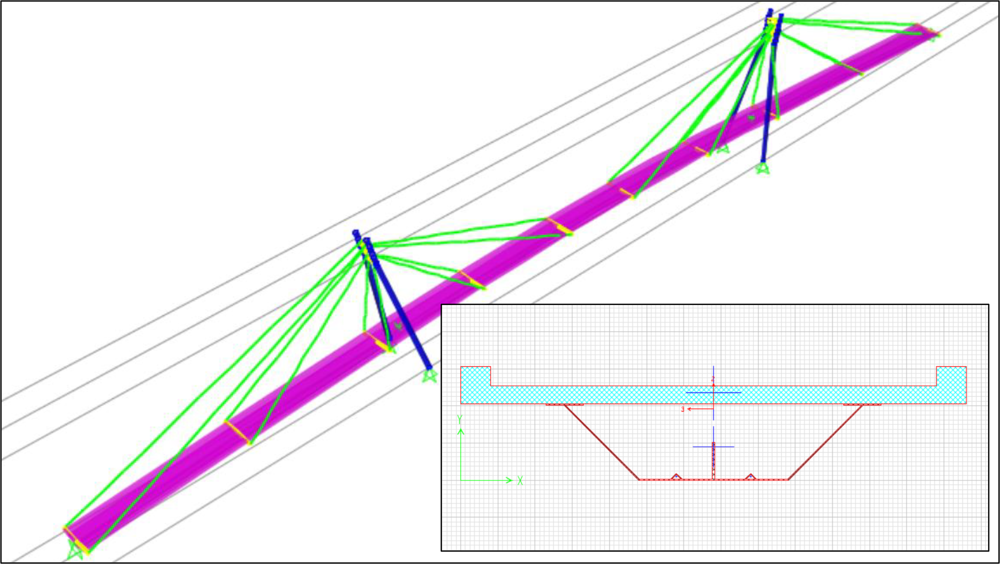
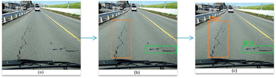

---
jupytext:
  formats: md:myst
  text_representation:
    extension: .md
    format_name: myst
    format_version: 0.13
    jupytext_version: 1.11.5
kernelspec:
  display_name: Python 3
  language: python
  name: python3
---

# Introducción

## Qué es la ciencia de datos?

Muy sucintamente puede definirse **Ciencia de Datos** como la "ciencia de aprender de los datos" según el Profesor David Donoho de la Universidad de Stanford{cite}`donoho2017`. Esta definición parece simple, pero refleja de manera fiel su naturaleza _científica_ y su objetivo último, _aprender_. Existen incontables definiciones más extensas y específicas del término como por ejemplo:

````{grid}

```{grid-item}
> Es el estudio de la extracción generalizable de conocimiento de los datos
>
> --_Vasant Dahr, New York University{cite}`vasant2013`_ 
```

```{grid-item}
> Es el campo inter-disciplinario que usa sistemas computacionales para extraer conocimiento de datos estructurados y no estructurados
>
> --_Filippo Chiarello, University of Pisa{cite}`chiarello2021`_ 
```

```{grid-item}
> ...obtener datos, entenderlos, procesarlos, extraer valor, visualizarlos y comunicarlos...
>
> --_Hal Varian, Google & UC Berkeley{cite}`mckinsey2009`_
```
````

Hay dos conceptos clave en estas definiciones: **datos** y **extraer conocimiento**. En primer lugar, los **datos** son observaciones de algún aspecto de la realidad. Es decir, no son _LA REALIDAD_, si no mediciones (ruidosas) de la realidad. Los términos _datos_, _observaciones_ y _mediciones_ serán utilizados de manera intercambiable. Por otro lado, la expresión de "extraer conocimiento" (o "aprender" o "extraer valor") implica, de manera general, obtener conclusiones que puedan ser generalizadas más allá de las observaciones.

``````{card} Control de calidad en un proceso

````{grid}

```{grid-item}
Una fábrica produce bulones de acero para la construcción con medidas, materiales y procesos de fabricación estandarizados. En cada turno, se fabrican alrededor de 5,000 bulones de un tipo específico y se necesita saber cuál es la resistencia media a la tracción de ese modelo de bulón. No se pueden ensayar todos los bulones fabricados porque es demasiado costoso en tiempo e insumos pero, sobretodo, porque la fábrica tiene que venderlos. Entonces se toman alazar unas pocas decenas de bulones de la tanda de 5 mil y se las ensaya. Podemos calcular el promedio de la resistencia de las muestras obtenidas, pero lo que realmente nos interesa es el promedio de toda la mezcla.

_Cómo relacionamos el promedio de la muestra con el promedio de toda la población?_

```
```{grid-item}

```

````

``````

``````{card} Estimación de acciones sobre una estructura

````{grid}

```{grid-item}
Para el diseño de un puente necesitamos conocer el valor de la velocidad de viento máxima en los próximos años. Para poder hacer una predicción más certera, contamos con mediciones para el sitio de emplazamiento del puente para los últimos 40 años. Podemos calcular el valor máximo, el mínimo, el promedio y mucho más para los últimos 40 años. Pero lo que realmente nos interesa es conocer cuál va a ser el valor máximo en los próximos años.

_Cómo relacionamos los valores pasados con los posibles valores futuros?_

```
```{grid-item}

```

````

``````

``````{card} Regresiones entre variables
````{grid}
```{grid-item}
Para el diseño de una nueva avenida en una ciudad, la agencia de tránsito de una ciudad está interesada en estimar el volumen de tráfico que usará la vía una vez inaugurada. Una muestra representativa implicaría medir el volumen de avenidas "similares" a la planificada, de acuerdo a los factores que creemos influyen en el volumen de una avenida, como la densidad de población y el ancho de la calzada. El problema es que hay muy pocas avenidas con características similares como para confiar en el promedio. Lo que hace la agencia, entonces, es tomar una muestra grande de volúmenes de tráfico, densidades poblacionales y anchos de calzada en distintas vías de la ciudad. Con esta muestra se puede estimar correlaciones entre el volumen y los otros factores observados. Pero lo que realmente interesa a la agencia es poder predecir el volumen de tráfico para una via cuya combinación de densidad poblacional y ancho de calzada no necesariamente fue observada.

_Cómo predecimos el volumen para la nueva avenida a partir de los volúmenes de las calles existentes?_
```
```{grid-item}

```
````
``````

### Objetivo y filosofía

De las definiciones y ejemplos vistos se desprende que el objetivo principal de la ciencia de datos es,

> Responder preguntas sobre el mundo real a partir de un conjunto limitado de observaciones

De los ejemplos queda claro, además, que el objeto último de la ciencia de datos no es el estudio de un conjunto específico de observaciones en sí, también llamado **muestra**, si no el conjunto de observaciones potencialmente realizables dentro de un determinado proceso físico real, también llamado **población**. La noción de **población** es un concepto amplio que involucra "todas las observaciones que podrían ocurrir" si repitiésemos el procedimiento de tomar muestras {cite}`vaughan2013` (ver {numref}`fig-poblacion`). En el ejemplo de los bulones, la población tiene forma clara y tangible: son todos los bulones obtenidos en la tanda. En el ejemplo de los vientos, por otro lado, la muestra son los vientos de los últimos 40 años, y la población incluiría además todos los vientos anteriores (no observados) y los futuros. Por último, en el ejemplo de los volúmenes de tráfico en la avenida, la muestra está compuesta por todas las vías medidas (incluso podrían ser todas las calles de una ciudad), pero la población también incluye hipotéticas calles con anchos de calzada y densidades poblacionales que no existen pero podrían existir [^Spiegelhalter].

[^Spiegelhalter]: Spiegelhalter habla de 3 tipos de poblaciones literales, virtuales y metafóricas.

```{figure} figuras/population_and_sample_2.png
:scale: 25 %
:alt: Información sobre el objetivo de la ciencia de datos
:name: fig-poblacion

El círculo rojo son las muestras que observamos, dentro de un universo posible de muestras (población general). Las conclusiones que más interesan son sobre la población general.

```

Y se desprende, además, que su principal herramienta es la _inferencia estadística_ que es la conceptualización matemática del razonamiento inductivo.

### Como disciplina

El concepto de "aprender de los datos" central en la ciencia de datos no es, sin embargo, nuevo, y existe desde mucho antes de que nadie hablara de ciencia de datos. Usar las propiedades de una muestra para inferir (o predecir) las propiedades de una población que las contiene se conoce como **inferencia estadística** (o estadística inferencial) se remonta a varios siglos atrás[^Gauss desarrolló el método de cuadrados mínimos hace 3 siglos??]. Sin embargo, recién a finales del Siglo XIX y principios del Siglo XX[^https://en.wikipedia.org/wiki/History_of_statistics] es cuando se convirtió en una discplina madura y formal. En este sentido, para muchos expertos la ciencia de datos no es más que una extensión de la inferencia estadística; o que de hecho son lo mismo{cite}`donoho2017`. 

Ya desde inicios de la segunda mitad del siglo XX, empezaron a surgir desarrollos y aplicaciones sobre datos que parecían incluir y exceder los enfoques de la estadística clásica. Estos desarrollos incluían el uso de sistemas informatizados para almacenar y procesar los datos, e incluso de analizarlos y encontrar modelos predictivos a partir de los mismos. En particular, el desarrollo de algoritmos automatizados para encontrar patrones y poder construir modelos predictivos incluso para grandes y complejos volúmenes de datos, hoy englobados dentro del término "aprendizaje de máquina", impulsó a la estadística clásica a dar un salto hacia adelante. La inferencia estadística, focalizada en la validación de hipótesis simplificativas sobre la población, hacía lugar a nuevos modelos que requerían hacer pocas (o nulas) hipótesis sobre las características de esta población y se concentraban en poder predecir lo más acertadamante posible observaciones de esta población. La novedosa flexibilidad de estos nuevos modelos era solo posible gracias al incremento exponencial del poder de cálculo introducido por la computación moderna, y se abría un abanico inmenso de nuevas aplicaciones posibles en todas las disciplinas.

``````{card} Clasficación de imagenes

````{grid}

```{grid-item}
En un contexto de planificación urbano-ambiental, una agencia gubernamental necesita hacer una evaluación del balance hídrico de una cuenca. Para esto, es útil conocer la geografía de la región, incluyendo los tipos de suelo y cursos de agua existentes. Esto puede ser una tarea gigante de realizar mediante inspecciones oculares. Por suerte, hoy en día, las imágenes satelitales permiten obtener información periódica sobre el estado del terreno, y son de acceso relativamente barato.

_Cómo usamos imágenes satelitales viejas para automatizar la clasificación de tipos de suelo en imágenes satelitales nuevas?_

```{grid-item}

```

````

``````

El auge de estos nuevos algoritmos y aplicaciones requirió también el desarrollo de técnicas computacionales para el almacenamiento y procesamiento de grandes cantidades de datos de estructuras muy diferentes (una sola imagen satelital son miles de numeritos con un determinado orden). En este contexto, se acuña en la década del 70 el término "ciencia de datos"{cite}`cao2017` como una disciplina más amplia que contiene a la inferencia estadística clásica y que incluye conocimientos de informática y cálculo computacional. Estas herramientas son combinadas, hoy en día, con conociemintos técnicos de los distintos ámbitos de aplicación. La ciencia de datos moderna es, entonces, una disciplina transversal y que ha permeado en los desarrollos de la mayor parte de las ingenierías y, en particular, de la ingeniería civil (ver {numref}`ciencia-datos`).

```{figure} figuras/burbujas_ciencia_de_datos.png
:scale: 25 %
:alt: Información sobre el objetivo de la ciencia de datos
:name: ciencia-datos

La ciencia de datos como encuentro de distintas especialidades

```

## Por qué hacemos ciencia de datos?

La ciencia de datos tiene la particularidad de intentar **responder preguntas sobre la realidad a partir de mediciones de la realidad**, que no podríamos responder de otra manera.

```{admonition} Teoría desconocida
:class: tip

Antes de realizar la recolección de datos de otras calles y avenidas de la ciudad, la agencia de tránsito se pregunta si esto es realmente necesario. Después de todo, sabemos intuitivamente que a mayor densidad poblacional hay mayor volumen de tráfico, y lo mismo para el ancho de calzada.

Puede deducirse una relación entre el volumen de tráfico de una avenida a partir de su densidad poblacional y ancho de calzada usando alguna teoría existente?

```

```{admonition} Condiciones desconocidas
:class: tip

La fábrica de bulones tiene un plan alternativo para encontrar la resistencia media de los producidos en un turno. Como se conocen las dimensiones y el material (y las dispersiones de estos), pueden deducir la resistencia de cada bulón a partir de la teoría de resistencia de materiales. Esto tiene un costo mucho menor que los ensayos.

Es este valor deducido confiable? Puede haber habido bulones defectuosas o una falla en los materiales?

```

En este sentido, existen tres tipos de procesos racionales para obtener conocimiento nuevo a partir de conocimiento pre-existente:
1. Inferencia deductiva: 
2. Inferencia inductiva:
3. Inferencia abductiva:

En ingeniería civil, como en la gran mayoría de las ciencias, necesitamos de datos cuando no podemos describir o predecir de manera exacta el comportamiento de los sistemas que estudiamos solo a partir de principios teóricos o deductivos. Esto puede deberse a que no existe una teoría consolidada (una serie de postulados dados por ciertos) sobre el tema en cuestión, como en el caso de la agencia de tránsito; o incluso habiendo una teoría consolidada, como la _resistencia de materiales_ en el caso de la fábrica de bulones, que estos postulados no apliquen de manera perfecta (o sea muy difícil aplicarla) a la situación de análisis.

La ciencia de datos utiliza la _inferencia inductiva_ como herramienta fundamental para la generalización del conocimiento obtenido a partir de mediciones parciales de algún aspecto de la realidad.

### Qué tipos de preguntas?

Por un lado, las preguntas que definen el objetivo de un problema específico pueden hacer referencia a una característica descriptiva de la población que puede calcularse a partir de sus elementos pero que no puede ser observada de manera directa. Este es el caso de la fábrica de los bulones: lo que interesa conocer es el valor medio de las resistencias de la población de bulones (no observable) y no la resistencia de algún bulón en específico (observable). En el ejemplo de la agencia de tránsito, en cambio, interesa inferir el valor del tránsito en una avenida en particular (observable). El hecho de que la avenida exista o no aún, es irrelevante en el concepto de "observable" o "no-observable".

``````{grid}

```{grid-item-card} sobre no-observables (parámetros)
Son cantidades calculadas a partir de un conjunto de elementos de la población, como el valor medio, el valor máximo, la correlación o asociación entre dos variables, etc. Se los denomina también **parámetros**.

```
```{grid-item-card} sobre observables (predicciones)
Son los elementos individuales de la población. Se los denomina también **realizaciones** o **predicciones**.
```

``````

La clasificación más relevante y comúnmente descripta en los libros de estadística, sin embargo, tiene que ver con las razones por las cuales postulamos las preguntas de interés. 

EJEMPLO

En muchos casos, lo que motiva las preguntas de interés es poder predecir de la manera "más precisa posible" un valor futuro, o no observado aún, de elementos de la población. Esto coincide con el tipo de preguntas "sobre observables" recién descripto. En este tipo de problemas, que se engloba dentro de la categoría de **inferencia predictiva**, no es relevante la estructura, es decir los parámetros, de la población; solo la capacidad de predicción del modelo. El auge de las últimas décadas en modelos de "aprendizaje estadístico" (machine learning) se centra en este tipo de modelos que maximizan la capacidad predictiva a costas de reducir la interpretabilidad del modelo. En el ejemplo de la agencia de tránsito, la pregunta sobre el volumen esperado para una nueva avenida entra adentro de la categoría de inferencia predictiva.

Dentro del mismo ejemplo, a la agencia de tránsito también le interesa conocer cómo puede variar el volumen de tráfico con la densidad poblacional para poder realizar proyecciones teniendo en cuenta el crecimiento demográfico de la ciudad. En este caso, interesa conocer el grado y tipo de asociación entre "volumen de tráfico" y "densidad poblacional" más que hacer predicciones de volumen específicas. Este tipo de preguntas entra dentro de la categoría de **inferencia asociativa**, donde el interés radica en entender la relación funcional entre dos o más variables por lo que la interpretabilidad del modelo juega un rol relevante.

Pero existe, además, otro tipo de preguntas, tal vez las más relevantes desde el punto de vista científico.

``````{card} Asociación o causalidad?

````{grid}

```{grid-item}
xxx

_Podemos usar X para predecir Y de manera razonable?_

_Si modificamos el valor de X, esperamos modificar Y?_

```{grid-item}

```

````

``````

En el ejemplo se refleja de manera obvia que una asociación (correlación) entre variables no necesariamente implica una relación causal. La diferencia radica en que la causalidad implica estudiar un sistema donde **intervenimos** activamente en la población para modificar una variable, por lo que las asociaciones de la población original no necesariamente se mantienen constantes. Cuando el objetivo de las preguntas es conocer una relación causal entre dos o más variables para poder evaluar intervenciones, el problema cae dentro de la categoría de **inferencia causal**. De nuevo, el interés radica en la estructura e interpretabilidad del modelo al igual que en la inferencia asociativa. La diferencia en este caso es que se necesitan hipótesis causales que no se pueden detectar automáticamente de las muestras en sí, a menos que un diseño experimental lo justifique.


``````{grid}

```{grid-item-card} Inferencia predictiva
Interesa princpalmente predecir correctamente el valor de potenciales nuevas observaciones. No es tan relevante la inrepretabilidad del modelo. Interesa inferir variables (observables).

```
```{grid-item-card} Inferencia asociativa
Interesa principalmente entender la estructura de la población para inferir asociaciones entre las variables. Interesa inferir parámetros (no-observables).
```
```{grid-item-card} Inferencia causal
Interesa principalmente entender la estructura de la población para inferir relaciones causa-efecto ante posibles intervenciones en los mecanismos que generan la población. Interesa inferir parámetros (no-observables).
```

``````

La línea entre las distintas categorías de preguntas no siempre es tan clara y en muchas ocasiones puede utilizarse el mismo tipo de modelo para distintas inferencias. Creemos que es útil, de todas maneras, tener en clara la distinción a la hora de plantear las preguntas.


## Cómo hacemos ciencia de datos?

xxx

```{figure} figuras/datascience_somerville.jpeg
:scale: 25 %
:alt: El proceso de la ciencia de datos
:name: fig-somerville

Caricatura del proceso de extraer conocimiento de un conjunto de observaciones realizada por David Somerville basado en el original de Hugh McLeod (https://random-blather.com/2014/04/28/information-isnt-power/).

```

El proceso de _construcción de conocimiento a partir de datos_ solo es posible mediante una adecuada definición del problema a resolver (las preguntas a contestar) y una adecuada planificación en la recolección, procesamiento y visualización de los datos disponibles. En este contexto, la ciencia de datos abarca una serie de etapas, retroalimentadas entre sí, donde cada una requiere de cuidadoso estudio y de técnica específicas:

1. Definición del problema: Planteo de preguntas que nos interesara contestar. Para que un problema esté _bien definido_ tiene que poder responderse a través de datos que podemos razonablemente obtener.

2. Recolección y preparación de los datos: Los datos pueden obtenerse a través de observaciones o experimentos. Hoy en día, las observaciones del mundo real vienen en una variedad inmensa de formato y modos de extracción, al punto de que la recolección de datos se ha transformado en una disciplina en su propio derecho. La recolección de datos involucra todas las técnicas necesarias para catalogar y guardar las observaciones para su posterior procesamiento. Esto puede hacerse de manera manual (como se hacía antes), o a través de técnicas de automatización que permiten la catalogación de grandes volúmenes de información (en formato digital principalmente). Esto se suele conocer en la actualidad como **data mining**.

3. Exploración de los datos: El Análisis Exploratorio de Datos (EDA) se centra en la caracterización de los datos obtenidos a través de resúmenes poblacionales y visualizaciones, con el objetivo de detectar patrones interesantes que permitan el desarrollo de modelos adecuados para los datos.

4. Construcción del modelo (de generación de datos):
La construcción del modelo implica la postulación de un conjunto de hipótesis sobre el proceso que generó los datos, su inferencia y validación en base a las observaciones disponibles. Distintos modelos pueden proponerse, compararse y mejorarse a la luz de los datos y el conocimiento disponible sobre el tema. Este paso es lo que se conoce tradicionalmente como **inferencia estadística**.

5. Aplicación / Toma de decisiones: Una vez que tenemos un modelo con el que estamos satisfechos, podemos utilizarlo para responder las preguntas de interés.


### Qué tipos de respuestas encontramos en la ciencia de datos?

Las preguntamos que planteamos en ciencia de datos no tienen respuestas exactas.

Respuestas sobre incertidumbres

> Data are noisy and inferences are probabilistic
>
> Doing Bayesian Data Analysis, Kruschke (2015)


---


```{admonition} xxx
:class: tip

El objetivo es construir y validar modelos de procesos reales con observaciones incompletas e imperfectas de esos procesos
`````

En muchos casos, nuestro conocimiento específico de un problema puede darnos una idea de como un sistema se comportará y como las variables relevantes interactúan entre sí, pero la forma específica de estas relaciones es desconocida.

```{note} Cuál es la relación entre los materiales y la resistencia del hormigón?

Es sabido que la resistencia del hormigón depende de la relaciónn agua/cemento, la cantidad y tipo de arena, del tamaño y calidad del agregado grueso, de los aditivos y del método de preparación. Sin embargo, la manera específica en que estas variables interactúan entre sí para dar una determinada resistencia no puede (al menos al día de hoy) ser deducida de principios teóricos físicos. Por esto, se han desarrollado modelos empíricos para poder entender la influencia de cada variable: es decir, relaciones deducidas a partir de los datos.

```

```{note} Es mejor la nueva máquina de compactación de asfalto?

xxx

```

```{note} Cuál es la influencia de un nuevo esquema tarifario de peajes?

xxx

```

Incluso en los casos en que existe una cantidad de conocimiento teórico acumulado que permite tener estimaciones aproximadas de cómo un sistema funciona o sobre qué valores esperamos observar de ciertas variables, las especificades del caso particular bajo análisis suelen ser parcialmente desconocidas. En estos casos también, la ciencia de datos aparece como una necesidad.

```{note} Cuánto es la resistencia de una mezcla de hormigón?

Un determinado fabricante de hormigón quiere saber cuál es la resistencia de un nuevo hormigón que está desarollando. Conoce exactamente los materiales utilizados, sus cantidades relativas y el procedimiento de fabricación. Además existe décadas de investigación sobre mezclas de hormigón que han permitido establecer ciertas relaciones entre los materiales utilizados y la resistencia final. Sin embargo, el proveedor no confía en las estimaciones teóricas porque pueden tener un error, o ni siquiera aplicarse de manera para este nuevo hormigón en sí.

El proveedor decide tomar muestras de la mezcla y ensayarlas. Cuál es la resistencia de le mezcla?

El fabricante puede además tomar muestras de otras mezclas ensyadas y compararlas con la nueva muestra. Cuánto mejor es la nueva mezcla?

```

En el mejor de los casos disponemos de un cuerpo robusto teórico que nos permite describir el comportamiento de un determinado fenómeno en función de unas pocas variables y parámetros a través de ecuaciones (por ejemplo, la mecánica del sólido). Pero incluso entonces necesitamos validar los parámetros e hipótesis de estos modelos con "la realidad".

```{note} Cuánto desciende la siguiente viga?

La teoría de la mecánica del sólido nos dice que la flecha puede calcularse como $f=\frac{Pl^3}{48EJ}$, donde $E$ es el módulo de elasticidad, $J$ el momento de inercia, $L$ la lontigud entre apoyos y $P$ la carga. Teóricamente podríamos medir estos valores y calcular la flecha sin necesidad de construir y ensayar la viga.

```

```{note} Calibración de modelos físicos

xxx

```

Por último, hay numerosas aplicaciones donde la descripción del modelo en sí y sus variables es poco relevante y el problema de interés es poder predecir de la mejor manera posible futuras observaciones.

```{note} Predicción de los vientos

xxx

```

```{note} Procesamiento de imagenes

xxx

```

## Objetivos de la ciencia de datos

Si bien el objetivo general de un problema de ciencia de datos es el mismo, obtener conclusiones sobre la población general a partir de una muestra particular, el objetivo específico de cada problema puede variar dependiendo de qué tipo de preguntas interesa responder. Estos distintos tipos de pregunta se vieron reflejados en los ejemplos de la sección anterior. Existen, entonces, fundamentalmente tres razones por las cuales hacemos inferencia:

Todos los casos descriptos tienen algo en común:

```{note}

El objetivo de la ciencia de datos es construir y validar modelos de procesos reales
`````

Hacemos ciencia de datos para responder preguntas. A continuación se describen algunos ejemplos típicos de aplicaciones de la ciencia de datos en las distintas ramas de la ingeniería civil. Y estos son solo una pequeña muestra del inmenso abanico de posibilidades.


``````{card} Ejemplo 1: Evaluación de la distribución de muestras

````{grid}

```{grid-item}
Una empresa constructora necesita verificar la calidad del hormigón enviada por el proveedor de manera de asegurarse que la resistencia real sea la adecuada según el diseño establecido. Para eso dispone de un laboratorio que realiza ensayos sobre probetas cilíndricas estandarizadas.

---
**Preguntas:**

_El hormigón que estamos usando es de la resistencia deseada?_

_Cuántas muestras debería tomar?_

---
**Datos:**  Observaciones de resistencias en probetas obtenidas al azar según ensayo normalizado en laboratorio

```
```{grid-item}

```

````

``````

``````{card} Ejemplo 2: Comparación entre muestras

````{grid}

```{grid-item}
Una empresa quiere probar una nueva máquina de compactación de mezclas asfálticas que, según el proveedor, permite mejorar el grado de densidad obtenida en la mezcla respecto del modelo viejo. La empresa cuenta con mediciones del grado de densidad en asfaltos compactados con la máquina vieja, y quiere realizar mediciones con la nueva para verificar lo que dice el proveedor.

---
**Preguntas:**

_Es la nueva máquina mejor que la que veníamos usando?_

---
**Datos:**  Serie de observaciones de densidad de la mezcla para la máquina vieja, y otra serie para la máquina nueva obtenidas en terreno


```
```{grid-item}

```

````

``````

``````{card} Ejemplo 3: Comparación entre muestras

````{grid}

```{grid-item}
En una ciudad se decide aumentar considerablemente el costo de los peajes sobre una autopista con el objetivo de desalentar el uso del auto privado en favor del transporte público. Para evaluar si la medida tuvo el efecto deseado, se midió la cantidad de autos que circulan por la autopista cada día, durante un mes previo, y un mes posterior al inicio del nuevo esquema tarifario.

---
**Preguntas:**

_El nuevo esquema tuvo efecto en la cantidad de autos circulando?_

_De qué magnitud fue el efecto?_

---
**Datos:** Serie de observaciones previas y posteriores al inicio del nuevo esquema obtenidas mediante conteo en estación de peajes.

```
```{grid-item}

```

````

``````

``````{card} Ejemplo 4: Caracterización de distribuciones

````{grid}

```{grid-item}
Se necesita diseñar un sistema de muros de protección contra inundaciones para un pequeño pueblo a la vera de un río. El criterio para diseñar la altura requerida de los muros, es el de que la probabilidad anual de que sean sobrepasadas sea menor al 0.1\% por año. Para realizar una estimación, se disponen de una serie histórica de mediciones del caudal máximo diario del río en cuestión que pueden transformarse en alturas del nivel del río a través de una curva descarga-nivel disponible.

---
**Preguntas:**

_Cuál es el nivel de caudal que tiene una probabilidad de 0.1\% anual de ser excedido?_

_Qué tan certera es esta afirmación?_

---
**Datos:** Serie temporal de descargas máximas diarias obtenidas en estación permanente de medición sobre el río

```
```{grid-item}

```

````

``````

``````{card} Ejemplo 5: Modelos de regresión

````{grid}

```{grid-item}
Una empresa de fabricación de hormigones busca entender mejor la relación entre la resistencia del hormigón y distintos factores que la pueden afectar como por ejemplo, la relación agua/cemento, la proporción de agregados o la presencia de superplastificante, entre otros. Como no dispone de un modelo analítico confiable para modelar esa relación, han realizado numerosos ensayos sobre muestras con distintos valores para cada una de las variables presumiblemente relevantes.

---
**Preguntas:**

_Existe influencia de cada una de las variables sobre la resistencia del hormigón?_

_Qué variables son más influyentes en la resistencia?_

_Cuánto varía la resistencia, cuando varío la relación agua/cemento en 0.05?_

---
**Datos:** Conjunto de observaciones de resistencia y propiedades para cada mezcla, obtenidos en laboratorio

```
```{grid-item}

```

````

``````

``````{card} Ejemplo 6: Modelos de clasificación

````{grid}

```{grid-item}
El desarrollo de métodos eficiente de evaluación de daño post-sismo sirve para mejorar la planificación y mitigación de este tipo de eventos, así como también asistir en el manejo de la emergencia. Para esto, es imperioso determinar el nivel del movimiento sísmico que genera que una estructura de determinadas propiedades, colapse. Existen numerosos modelos analíticos y numéricos para este fenómeno, pero no es fácil capturar en ellos las complejidades de las estructuras reales. Alternativamente, se dispone de datos de un evento sísmico pasado donde se anotaron los registros sísmicos ocurridos y también el nivel de daño sostenido por las estructuras en una región.

---
**Preguntas:**

_A qué nivel de intensidad sísmica colapsan las estructuras?_

_A qué nivel de intensidad se alcanza determinado nivel de daño?_

_Qué variables de las estructuras son importantes?_

---
**Datos:** Observaciones en terreno de nivel de daño, tipología estructural, y características arquitectónicas para cada estructura

```
```{grid-item}

```

````

``````

``````{card} Ejemplo 7: Causalidad versus correlación

````{grid}

```{grid-item}
xxx

---
**Preguntas:**

---
**Datos:**

```
```{grid-item}

```

````

``````


``````{card} Ejemplo 8: Calibración de modelos físicos

````{grid}

```{grid-item}
Una empresa de diseño y análisis estructural y geotécnico, realizó el modelado estructural de un puente a través de elementos finitos. Para la construcción de este modelo numérico se utilizaron distintos ensayos en los materiales para poder caracterizar sus comportamientos mecánicos, y muchos otros parámetros del modelo fueron definidos a juicio experto del modelador en base a la bibliografía disponible y confiable. Sabiendo que el modelo es una simplificación de la realidad, a la empresa le interesa poder modelar el comportamiento del puente una vez que ya fue construida. Para eso realiza mediciones de los desplazamientos del puente ante distintas cargas.

---
**Preguntas:**

_Se pueden caracterizar los parámetros del modelo numérico a partir del comportamiento real?_

_Puede predecirse el comportamiento del puente luego de ser construido?_

---
**Datos:** Observaciones en terreno de los desplazamientos obtenidos mediante acelerómetros en distintos puntos de la estructura

```
```{grid-item}

```

````

``````

``````{card} Ejemplo 9: Modelos avanzados de clasificación: clasificación de imágenes

````{grid}

```{grid-item}
El desarrollo de la tecnología de sensores remotos hace que, hoy en día, sea barato y accesible para cualquiera obtener imágenes de manera periódica y automatizada en vastas extensiones. Por eso, una empresa de mantenimiento de rutas y autopistas, adquirió drones para monitorear regularmente el estado de las superficies de rodamiento de una red de miles de kilómetros. El análisis manual de este inmenso volumen de imágenes es costosísimo en términos de horas hombre.

---
**Preguntas:**

_Puede desarrollarse un modelo para detectar grietas y baches a partir de las fotos?_

_Qué tan confiable es?_

---
**Datos:** Fotos de los elementos estructurales obtenidos mediante un dron

```
```{grid-item}

_*Arya et el (2021), RDD2020: An annotated image dataset for automatic road damage detection using deep learning_
```

````

``````

``````{card} Ejemplo 10: Modelos avanzados de clasificación: clasificación de imágenes

````{grid}

```{grid-item}
En un contexto de planificación urbano-ambiental, un gobierno necesita hacer una evaluación del balance hídrico de una cuenca. Para esto, es útil conocer la geografía de la región, incluyendo los tipos de suelo y cursos de agua existentes. Esto puede ser una tarea gigante de realizar mediante inspecciones oculares. Por suerte, hoy en día, las imágenes satelitales permiten obtener información periódica sobre el estado del terreno, y son de acceso relativamente barato.

---
**Preguntas:**

_Puede desarrollarse un modelo para caracterizar el uso del suelo a partir de las imágenes satelitales?_

_Qué tan confiable es?_

---
**Datos:** Imágenes satelitales ópticas de la región

```
```{grid-item}

```

````

``````

## Objetivos de la ciencia de datos


Si bien el objetivo general de un problema de ciencia de datos es el mismo, obtener conclusiones sobre la población general a partir de una muestra particular, el objetivo específico de cada problema puede variar dependiendo de qué tipo de preguntas interesa responder. Estos distintos tipos de pregunta se vieron reflejados en los ejemplos de la sección anterior. Existen, entonces, fundamentalmente tres razones por las cuales hacemos inferencia:

MODELOS PARAMÉTRICOS Y NO PARAMÉTRICOS?

`````{card} Para describir un proceso: Inferencia descriptiva (modelos generativos)

La inferencia descriptiva busca caracterizar e interpretar un número limitado de variables que caracterizan la población general. Por ejemplo, encontrar el valor medio de una determinada población y compararlo con el valor medio de otra población. En modelos con observaciones de varias variables, los parámetros de interés para la inferencia pueden ser los que caracterizan las correlaciones entre las variables (en un problema de regresión lineal por ejemplo). El objetivo es puramente descriptivo y asociado a parámetros existentes, determinísticos, aunque desconocidos.

```{tip} Algunos ejemplos

1. Es la nueva máquina mejor que la que veníamos usando?
2. Qué variables son más influyentes en la resistencia?
3. Calibración de modelos físicos

```

`````

`````{card} Para prededcir un proceso: Inferencia predictiva (modelso predictivos)

La inferencia predictiva se centra en encontrar los posibles valores de muestras no observadas aún (muestras futuras, o muestras presentes pero no observadas). Este tipo de inferencia se apoya en la inferencia descriptiva ya que requiere estimar los parámetros primero, para poder obtener las predicciones luego. Sin embargo, el foco no está puesto ni en el valor, ni en el significado de estos parámetros. Por ejemplo, muchos problemas en ingeniería involucran predecir un valor futuro (no el valor medio únicamente) de una variable en base a observaciones presentes. Además, inferencias sobre las predicciones son la herramienta principal para comparar modelos entre sí.

```{tip} Algunos ejemplos

2. Cuál es el nivel de caudal que tiene una probabilidad de 0.1\% anual de ser excedido?
3. Modelos de clasificación de imágenes

```

`````

`````{card} Para intervenir un proceso: Inferencia causal (modelos causales)

La inferencia causal busca responder preguntas sobre otra población, distinta a la que generó los datos observados. Una población obtenida a partir de intervenir el mecanismo de generación de datos, por ejemplo, modificando alguno de sus parámetros. La diferencia respecto de los otros tipos de inferencia a veces es sutil e indistinguible y a veces obvio. La inferencia descriptiva o predictiva busca establecer relaciones en los datos que permitan extrapolarse a combinaciones de valores no observadas, pero siempre y cuando las condiciones de la población general no se hayan modificado. En cambio la inferencia causal busca determinar las características de la población si cambiara las condiciones (por ej. alguno de las características del proceso).

Por ejemplo, el ejemplo del nuevo esquema tarifario de peajes puede pensarse como un problema de inferencia descriptiva donde se debe comparar el valor medio de autos antes y después del esquema. Una posible diferencia puede deberse a otros factores no relacionados al esquema, aunque solo con esa información no podemos saberlo. La inferencia causal implica pensar en todos los posibles factores que puedan afectar a las observaciones, de manera de poder aislar en el análisis el efecto causal directo entre la intervención (el nuevo esquema tarifario) y la variable observada (cantidad de autos). Este tipo de análisis pone de relieve que la correlación no es causalidad.

```{tip} Algunos ejemplos

1. El nuevo esquema tuvo efecto en la cantidad de autos circulando?
2. xxx

```

`````


---
## Referencias

```{bibliography}
:style: unsrt
```
